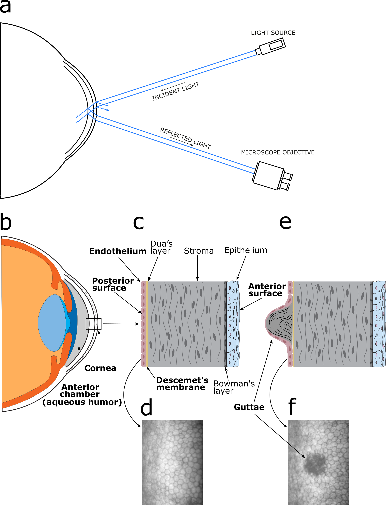
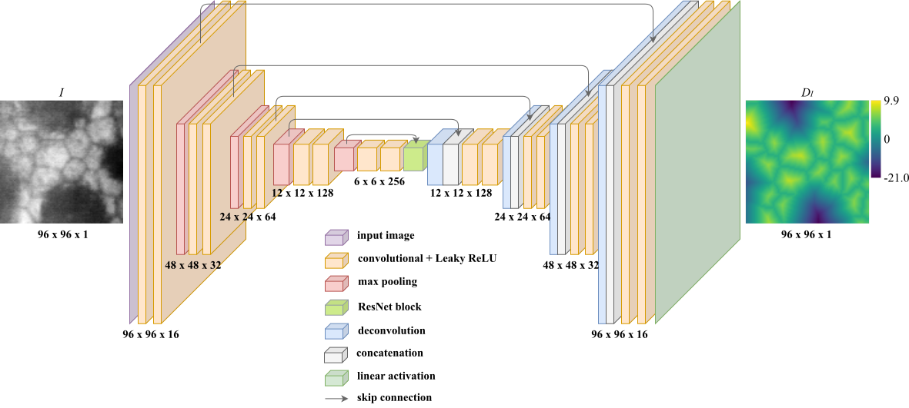

# Corneal endothelium assessment in specular microscopy images with Fuchs' dystrophy via deep regression of signed distance maps

#### by Juan S. Sierra et al. (https://www.researchgate.net/profile/Juan-Sierra-Bravo) 

The original paper can be found  [here](https://www.researchgate.net/profile/Juan-Sierra-Bravo).

## Abstract
Specular microscopy assessment of the human corneal endothelium (CE) in Fuchs' dystrophy is challenging due to the presence of dark image regions called guttae. This paper proposes a UNet-based segmentation approach that requires minimal post-processing and achieves reliable CE morphometric assessment and guttae identification across all degrees of Fuchs' dystrophy. We cast the segmentation problem as a regression task of the cell and gutta signed distance maps instead of a pixel-level classification task as typically done with UNets. Compared to the conventional UNet classification approach, the distance-map regression approach converges faster in clinically relevant parameters. It also produces morphometric parameters that agree with the manually-segmented ground-truth data, namely the average cell density difference of -41.9 cells/mm<sup>2</sup> (95% confidence interval (CI) [-306.2, 222.5]) and the average difference of mean cell area of 14.8 μm<sup>2</sup> (95% CI [-41.9, 71.5]). These results suggest a promising alternative for CE assessment. 

## About this repository

### Files

This repository is a simplified version of the project, it doesn't contain the postprocessing operations.

To clone this repository: `git clone https://github.com/opi-lab/signed-distance-maps-for-corneal-endothelium.git`

The folder structure should be:

```
signed-distance-maps-for-corneal-endothelium/
    ├── datasets/
        ├── model/
        ├── training/
        └── validation/
    ├── guttae/
        ├── deeptrack/
        ├── loaders.py
        ├── models.py
        └── utils.py
    ├── imgs/
    ├── seg_data.ipynb
    ├── setup.py
    ├── test_dataset.py
    └── train.py
```

### Try the trained model

In the directory `./datasets/validation/` of the main folder, there is an image of cornea guttata and its curated segmentation. To run the trained model, check the `./seg_data.ipynb` notebook.

### Train the model

To train the model from console, you must use the command:

`python train.py setup [-i | -e | -p | -r | -n]`

<strong>Options</strong>

`-i` Index. It is possible to define more than one architecture in the `./setup.py` file. The index defines which of the architectures will be trained.

`-e` Epochs. The default value is $100'000$. It defines the number of epochs.

`-p` Patience. The default value is $100$. Number of epochs with no improvement after which training will be stopped.

`-r` Repetitions. The default value is $1$. Number of times the model will be trained.

`-n` Model name. The default value is the name of the computer username. After finishing the training, the models and the weights will be saved with the given name. 

<strong>Example</strong>

`python train.py setup -i 0 -e 10 -r 10 -n test`

This command will execute the training of the first architecture 10 times with 10 epochs, after which the model will be saved with the name <em>test</em>. So, when the training has finished, 10 trained models will be saved in the directory `./datasets/models/test/`.

## Problem statement and motivation

The human corneal endothelium (CE) is responsible for maintaining corneal transparency and its proper hydration, both critical for good vision. It can be imaged <em>in vivo</em> with specular microscopy, and the resulting images can be analyzed to obtain clinical information by quantifying cell morphometric parameters, like cell density. However, this quantification requires the accurate detection of cell contours, which is especially challenging in the presence of corneal endotheliopathies, such as Fuchs’ dystrophy. Moreover, although anterior segment optical coherence tomography has been proposed for Fuchs' dystrophy grading, it does not provide CE morphometric parameters, which specular microscopy does.

Specular microscopy is based on illuminating the cornea with a narrow beam of light (Fig. 1(a)) and capturing the specular reflection from the posterior corneal surface. Most of the incident light is either transmitted into the eye's anterior chamber (Fig. 1(b)) or reflected by the epithelial surface at the anterior surface of the cornea. None of these fractions of the incident light are useful for acquiring the endothelial image but the tiny fraction (about 0.22%) reflected by the posterior corneal surface (Fig. 1(c)). The CE image is a trade-off between the width of the beam and the corneal thickness. Once acquired, the normal endothelial cells appear gray, forming a regular tessellation (Fig. 1(d)). The irregularities in the surface (Fig. 1(e)) produce reflected rays in directions other than the corresponding specular reflection and, consequently, appear as dark regions (Fig. 1(f)).

<p align="center">
    
</p>
<p align="center">
    <strong>Fig. 1.</strong> Schematic of the CNN architecture.
</p>

In this work, we propose a deep learning-based method to carry out reliably the segmentation task in specular microscopy images in the presence of cornea guttata. We use a CNN architecture based on the UNet model for mapping the input image to a signed distance map, from which we obtain the cell and guttae segmentation, which we call <em>UNet-dm</em>. Our network demonstrates rapid convergence and robustness in terms of clinically relevant CE morphometric measures. We evaluate the main CE morphometric parameters necessary to estimate its health status and compare them with manual references. Moreover, we compare the results with the evaluation performed by the <em>CellCount</em> microscope software from Topcon (where the cell size-dependent parameters are usually overestimated). Our results show an improvement over conventional UNet-based methods and the Topcon software used routinely in the clinical setting. 

## Brief description of the method

UNet-dm infers a signed distance map from a given CE image, where positive values indicate cell bodies and negative values guttae. The architecture is shown in Fig. 2. 

<p align="center">
    
</p>
<p align="center">
    <strong>Fig. 2.</strong> Schematic of the CNN architecture.
</p>

By using this method, we found several advantages:

1. Accurate segmentation of touching objects like cells
2. Robustness to unreliable ground-truth segmentations which are often problematic due to poorly-defined cell or guttae boundaries
3. Continuity and smoothness constraints implied in estimating distance maps facilitate the detection of guttae, especially when they cover a significant area of the image
4. Reduced learning complexity and rapid convergence using a relatively small dataset.


## Citation

If you find this code useful, please consider citing:

```
bibtext
```

